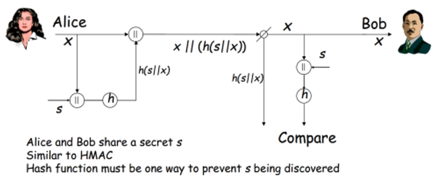

# Part 6: Exercise 2: Authentication Server
Students apply the knowledge from previous parts to implement a message authentication scenario for secure communications.

## Exercise 2: Message Authentication in a Client/Server Architecture

Switch to the Part 6 directory (`cd ../part6`).

Write a pair of client/server bash scripts to implement a message authentication scenario. The client program (Alice) hashes a shared secret value `s` with some message `x` and sends the message and the appended hash to the server (Bob). The server program should take message `x` and perform its own hash of shared secret `s` and message `x`, then compare it to the hash value sent by the client. If the two match, the server should report a message of success. Note that we assume both parties already know `s`, so there’s no need to do a shared secret exchange. 

<p align="center">  </p>

Perform this message authentication scenario 3 times using the hash functions MD5, SHA1, and SHA256. Have each program print output to the screen for each step in the exchange.

See [`bash-basics.sh`](../part4/bash-basics.sh) and [Part 5](../part5/part5.md) for the background knowledge you will need to write the scripts for this exercise. Start with the skeleton code with comments explaining what you should be doing where in [`alice-client.sh`](alice-client.sh) and [`bob-server.sh`](bob-server.sh). 

Use the following sample values:
```
x = "The workshop is almost finished!"
s = "shh it's a secret"
```

You should start `bob-server.sh` before `alice-client.sh`.

## → [(optional) Part 7: Exercise 3: Algorithm Runtime Comparison](../part7/part7.md)
